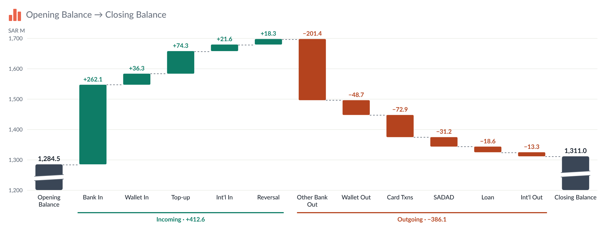

# Waterfall — Tableau Viz Extension

A waterfall chart (Start → changes → End) based on the *Balance flow* mockup (`balance-flow-figma.html`). The icon,
title, explanation and card options are the same as **KPI Card 3**, and so is the number formatting.



```
waterfall.trex   manifest: Marks card tiles + "Format Extension" button
index.html       chart page
chart.css/js     header, data reading, chart drawing, tooltip, right-click menu
configure.*      Format dialog (every option below)
config.js        shared defaults, number formatting, the KPI Card 3 icon set
icons.js, icons/ the Figma icons (same files as KPI Card 3)
fonts/           Lato 2.0 (OFL)
serve.py/.sh     local server on :8767, also lists Tableau shape palettes
dev/             browser preview with sample data (no Tableau needed)
```

## Run it

```bash
chmod +x serve.sh && ./serve.sh
```

In Tableau Desktop (2024.2+): Marks card → mark type dropdown → **Add Extension** → **Access Local Extensions** →
`waterfall.trex`.

To try it without Tableau, open <http://localhost:8767/dev/preview.html>. It has four sample data sets (the Figma
balance flow, a breakdown dimension, raw SAR values, negative values; the breakdown set has two dimensions) and opens the Format dialog next to the chart.

| Marks card tile | What to drop | Drives |
| --- | --- | --- |
| **Start** | one measure | the first bar |
| **Changes** | one measure per change, dropped **one at a time** (up to 30) | the bars in between, in the order of the pills on the tile |
| **End** | one measure | the last bar. Leave it empty to calculate End = Start + changes |
| **Breakdown** | one or more dimensions (optional, up to 6) | splits change bars into segments, e.g. by account type and segment. Each bar picks which of these it uses (Format → Bars → Breakdown) |

- Change bars float from the running total. Start and End bars stand on the axis.
- If End doesn't equal Start + changes, the End tooltip shows the difference.
- If outflows are stored as positive amounts, tick **Invert sign** for those bars.
- If Tableau delivers the changes as *Measure Names / Measure Values*, the extension pivots them back. Nothing to do.

## Formatting

Viz extensions can't add their own entries to Tableau's right-click menu. There are two ways in:

- **Format Extension** button at the bottom of the Marks card (the manifest's `<context-menu>`).
- **Right-click a bar** in the chart → *Format "Bank In"…*, Groups…, Axes…, Lines…, Numbers…. **Double-click** a bar
  opens its settings directly.

The dialog is modeless, so the chart updates as you change things. **Cancel** undoes everything since the dialog
opened, and **Reset tab** restores the defaults for that tab.

| Tab | Options |
| --- | --- |
| Icon | as KPI Card 3: built-in Figma icons, Tableau shapes, upload, size, colour |
| Title & text | as KPI Card 3. An empty title shows "Start → End" |
| Bars | pick **Start**, any **change**, or **End**, then set it:<br>• label · colour (changes: Increase/Decrease colour or custom) · invert sign<br>• **total value**: show/hide, place (above, inside top/middle/bottom, below, or at the end it moves to), size, weight, colour<br>• **clipped-bar marker** (bar is longer than it looks): show/hide, slanted lines (Figma) / zigzag / gap, position, colours<br>• **breakdown** (changes): show/hide, **which Breakdown dimensions** this bar splits by (tick one or several) and their **order in the segment name** (▲ ▼), name separator, colours (shades of the bar colour, or one colour per member), divider lines, show values, member names, place (inside / left / right), size, weight, text colour, hide on small segments<br>• *Apply these settings to all changes*<br>**All bars:** width, corner radius, Increase/Decrease colours, breakdown order, calculate End, tooltip, right-click menu |
| Groups | none · **increases / decreases** (runs of consecutive ups and downs, like *Incoming · +412.6* in Figma) · **custom** groups you name and assign. Per group: text, colour, show total. Style: line (solid, dashed, dotted, bracket), width, inset, text size and weight, separator, optional shading behind the bars |
| Axes | **Vertical:** starts at zero / close to the data (room below, %) / fixed value · fixed or automatic maximum · tick count · side · title (e.g. *SAR M*) · font, size, weight, colour · axis line · own number format or the shared one. **Horizontal:** labels on/off, horizontal (wrapping) / angled / vertical, max lines, font, size, weight, colour, axis line |
| Lines | horizontal gridlines, vertical gridlines, connector lines, zero line: each with show, colour, width, solid / dashed / dotted |
| Numbers | **All numbers the same** or **Each label its own** · K / M / B / Dynamic / full / Percentage / Percentage dynamic / workbook format · 0–1 ratio · decimals · unit text and position · "+" on increases · negatives as −201.4, -201.4 or (201.4) · chart font |
| Card | as KPI Card 3: padding, space above the chart, dashed divider, background colour and opacity |

With **Each label its own**, every bar's total, every breakdown and the group totals get their own format editor. Each
one starts as a copy of the shared format, and *Copy this format to every label* resets them all to it.

### When the axis doesn't start at zero

With *Starts at → Close to the data*, the axis begins a little below the lowest running total (rounded to a tick), as in
the Figma design. Start and End bars are then cut short, so they get the clipped-bar marker. Switch to *Zero* for full
bars.

## Settings and deploying

Change settings are stored per measure, by the pill's name (e.g. `SUM(Bank In)`). Renaming or swapping the measure
starts it from the defaults. Everything is saved in the workbook.

1. Vendor the API library into `lib/tableau.extensions.1.latest.js`. Otherwise the page loads it from jsDelivr.
2. Host the folder over HTTPS and change `<source-location><url>` in `waterfall.trex`.
3. Add the URL to the Tableau Server/Cloud extension safe list. `dev/` doesn't need to be deployed.

Tableau reads the `.trex` only when the extension is added, so after editing it, remove the extension and add it again.
